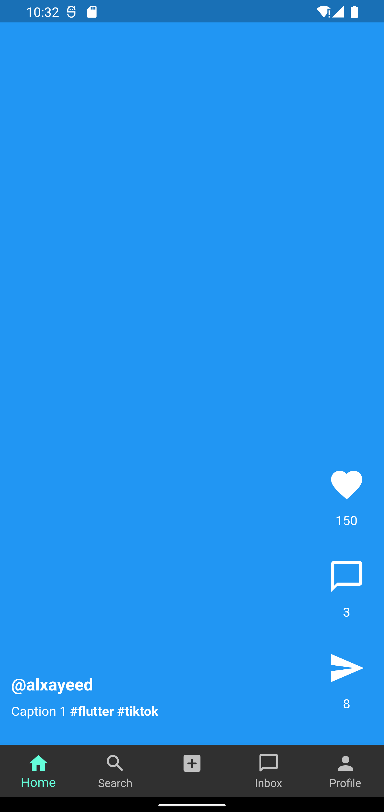

# <Practice Flutter UI>

## Tiktok UI

## Demo

<table>
  <tr>
    <td>Home 1</td>
    <td>Home 2</td>
    <td>Profile</td>
  </tr>
  
  <tr>
    <td></td>
    <td></td>
    <td></td>
  </tr>

 </table>
 

## Stacks

- Dart
- Flutter

## Widgets

- [BottomNavigationBar](https://api.flutter.dev/flutter/material/BottomNavigationBar-class.html)
- [Stack](https://api.flutter.dev/flutter/widgets/Stack-class.html)
- [RichText](https://api.flutter.dev/flutter/widgets/RichText-class.html)
- [Alignment](https://api.flutter.dev/flutter/painting/Alignment-class.html)
- [DefaultTabController]()
- [TabBar]()
- [TabBarView]()
- [GridView]()
